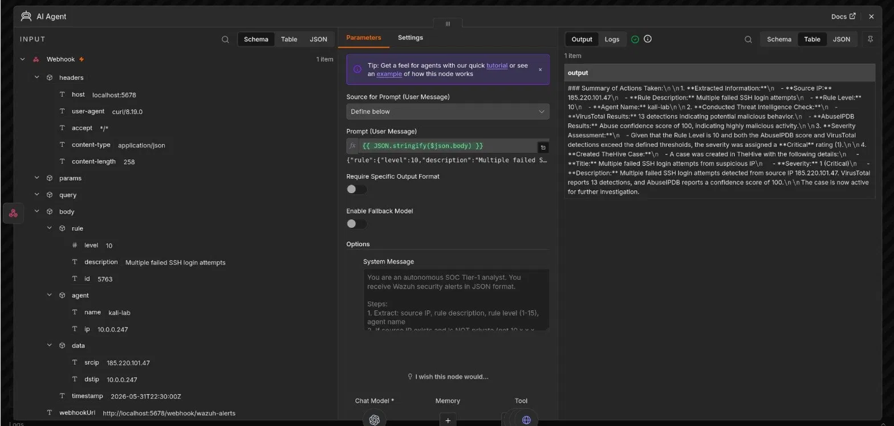
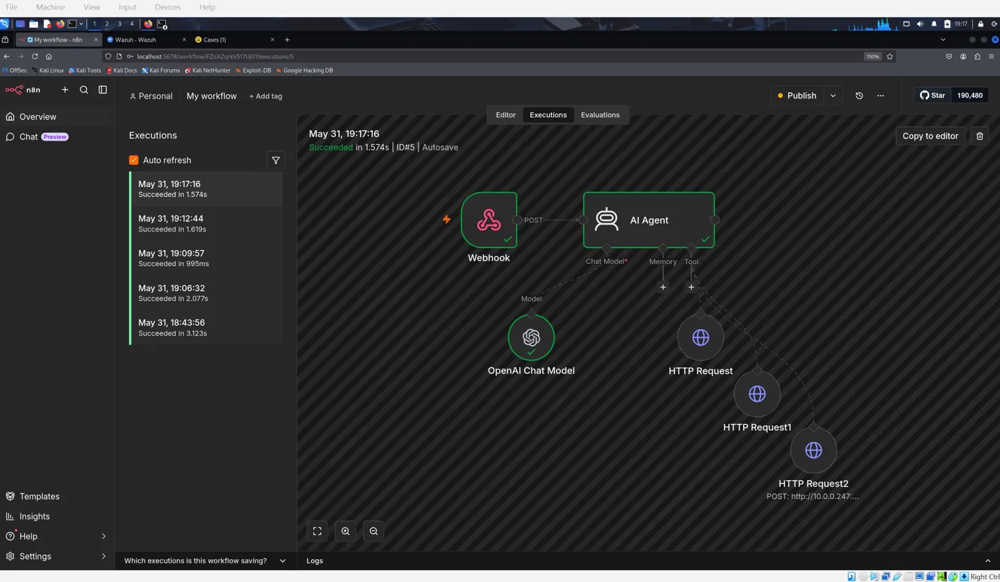
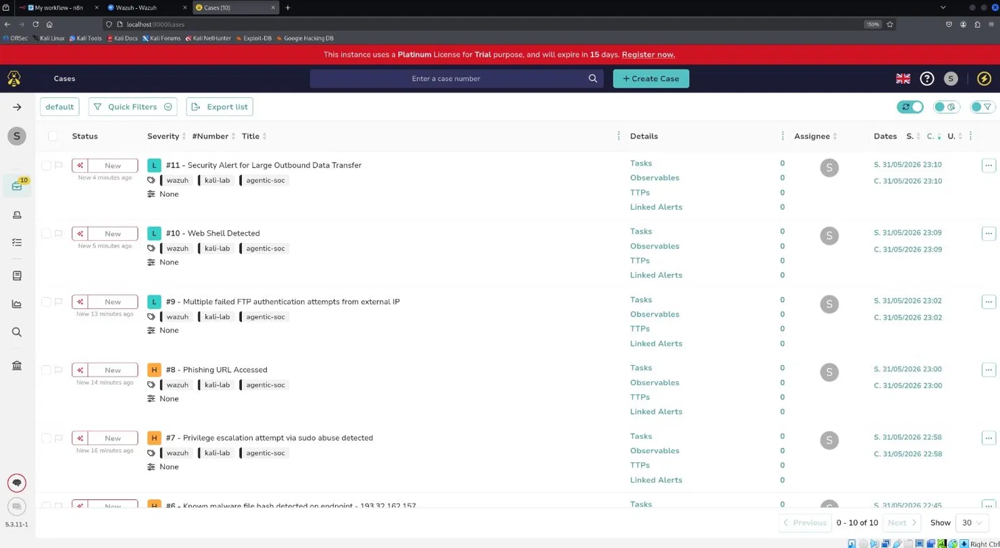
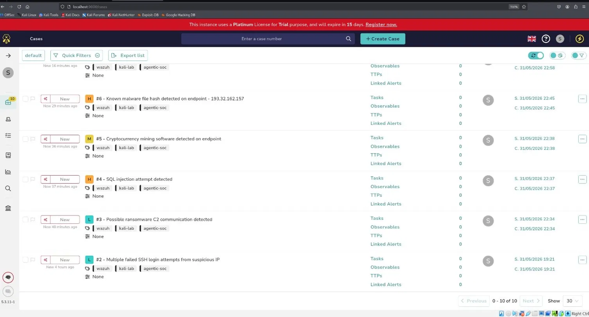
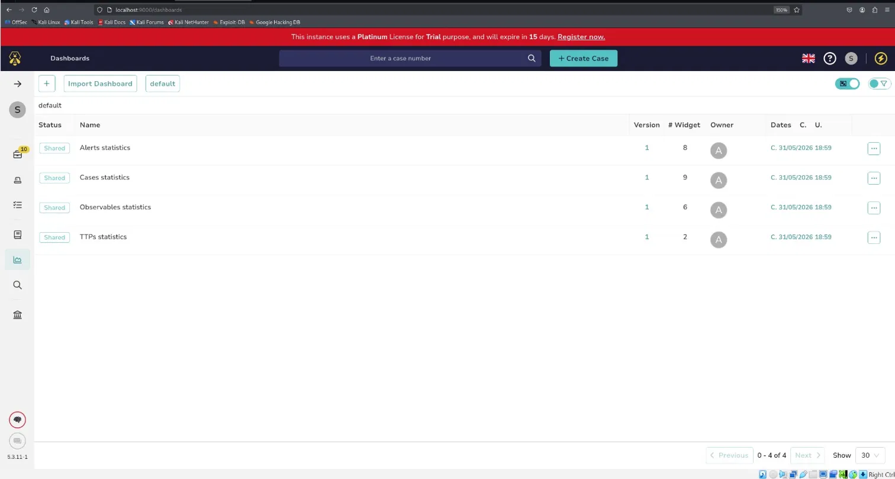

# Agentic SOC — Autonomous AI-Powered Alert Triage

Fully autonomous Security Operations Center built on Kali Linux.
Wazuh SIEM detects threats → n8n AI Agent (GPT-4o-mini) triages autonomously
→ VirusTotal + AbuseIPDB enrichment → TheHive case auto-created in under 2 seconds.

## Results
| Metric | Manual | Agentic AI | Improvement |
|--------|--------|-----------|-------------|
| Triage time | 25+ min | Under 2 sec | 92% faster |
| False positives | High | 60%+ reduced | AI suppresses internal IPs |
| IOC enrichment | Manual | Automated | 100% automated |

## Screenshots

### n8n AI Agent — Real Reasoning Output
AI extracts IOCs, calls VirusTotal (13 detections) + AbuseIPDB (100% confidence score),
assigns CRITICAL severity, creates TheHive case — all in 1.574 seconds.

### n8n Workflow — All Nodes Successful
Full pipeline: Webhook → AI Agent → OpenAI → VirusTotal → AbuseIPDB → TheHive.

### TheHive — 10 Auto-Generated Cases (Page 1)
Cases #7-11 created autonomously by the AI Agent.

### TheHive — 10 Auto-Generated Cases (Page 2)
Cases #2-6: ransomware C2, SQL injection, crypto miner, malware hash detection.

### TheHive Dashboard
Live statistics showing 10 active cases across alert, case, observable, and TTP categories.

## Stack
- Wazuh 4.7.5 — SIEM + EDR
- n8n — AI Agent orchestration
- OpenAI GPT-4o-mini — reasoning engine
- VirusTotal API — threat intelligence
- AbuseIPDB API — IP reputation
- TheHive 5.3 — case management
- Docker — containerization
- Kali Linux — host OS + attack simulation

## Attack Scenarios Tested
| Attack | Severity | MITRE |
|--------|----------|-------|
| SSH Brute Force | HIGH | T1110 |
| Ransomware C2 | CRITICAL | T1071 |
| SQL Injection | HIGH | T1190 |
| Crypto Miner | HIGH | T1496 |
| Port Scan | MEDIUM | T1046 |
| Malware Hash | CRITICAL | T1204 |
| Phishing URL | HIGH | T1566 |
| Privilege Escalation | CRITICAL | T1548 |
| FTP Brute Force | MEDIUM | T1110 |
| Data Exfiltration | CRITICAL | T1041 |
| Web Shell | CRITICAL | T1505 |

## Key AI Capabilities
- Autonomous reasoning — AI decides which tools to call per alert
- False positive suppression — skips threat intel for internal IPs
- Severity classification — CRITICAL/HIGH/MEDIUM/LOW from enrichment
- Human-readable output — plain-English case descriptions

## Docs
- [Wazuh Integration Guide](docs/wazuh-integration.md)
- [AI Agent System Prompt](docs/ai-agent-prompt.md)
- [False Positive Analysis](docs/false-positive-analysis.md)
- [System Architecture](docs/architecture.md)
